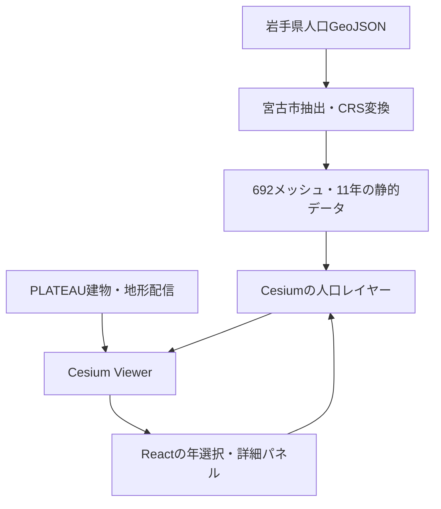

# 宮古市の人口減少を3Dで可視化するMVP計画

調査日：2026年9月5日。対象：岩手県宮古市（自治体コード `03202`）。実装者：React / TypeScriptに習熟したWebエンジニア1名を想定。

**推奨：React + Vite + TypeScript + CesiumJS。人口は国土数値情報の令和6年推計、建物はPLATEAU宮古市2025年度のLOD1を使用する。人口を事前に宮古市692メッシュへ絞り込み、3D Tilesと地形は公式配信から読み込む。**

動作するMVPまで実作業12〜16時間を目標とする。これは設計上の見積もりであり、実装・描画性能の実測値ではない。範囲はローカルでの開発サーバーと本番ビルドの動作確認まで。公開ホスティング、独自の人口推計、CityGML変換は含めない。

## 1. 調査で確認できたこと

公式の説明ページに加え、配布データの実体を取得・検査した。検索結果だけを根拠にした配布仕様は採用していない。

| 項目 | 確認結果 | 確認の限界 |
|---|---|---|
| 岩手県の500m将来人口 | 公式GeoJSON ZIPを取得・展開。県内16,684件、`SHICODE == "03202"` は692件、`MESH_ID` 重複なし | データ公開後の改訂はあり得る |
| 人口の年次 | `PTN_2020` と `PTN_2025`〜`PTN_2070` の5年刻み、計11時点が全692件に存在 | 年ごとの値や連続的な人口変化は提供データではない |
| 人口の数値 | 採用する11列にnull・非数値・負数なし。2020年ゼロ人口は0件、2070年ゼロ人口は225件 | 将来も欠損がないと一般化しない |
| 宮古市PLATEAU 2025年度 | G空間情報センター公式カタログAPIで提供を確認。公式配信カタログからLOD1のURLを取得 | 2025年度という名称は全建物の測量時点が2025年という意味ではない |
| 建物の配信実体 | LOD1 `tileset.json` と参照先 `.b3dm` 1件がHTTP 200。両方で `Access-Control-Allow-Origin: *` を確認 | 全410コンテンツ参照先の取得・ブラウザー描画は未検証 |
| 建物の整備範囲 | 2025年度索引図を画像で確認。R6のLOD1範囲66.44km²とR7の整備範囲20.97km²が記載され、市全域を覆うデータではない | 記載面積を独自に足して厳密な整備面積・市域カバー率とはしない |
| 地形 | PLATEAU-Terrainの `layer.json` がHTTP 200、CORS許可。quantized-mesh・楕円体高の提供を公式資料で確認 | 宮古市の地形タイル全件の到達性・精度は未検証 |
| 行政界 | 2025年度カタログの関連ZIPを取得。行政界は1,823件のLineString | 面ポリゴンではないため、そのまま人口の切り抜きには使えない |

根拠：[人口公式配布ページ][P1]、[人口ZIP][P2]、[宮古市2025年度公式カタログAPI][B2]、[PLATEAU配信カタログ][B3]、[2025年度索引図][B5]、[地形配信仕様][T1]。

調査の補助として2024年度3D Tiles ZIPも取得し、LOD1 / LOD2を確認した。最終案では、公式配信が確認でき、整備範囲が追加されている2025年度LOD1へ統一する。2024年度と2025年度の建物レイヤーを重複表示しない。

### このMVPが表現するもの

- **人口：宮古市に割り当てられた500mメッシュの基準人口と将来推計人口。** 市境は原典の `SHICODE` に従う。
- **都市：公開された宮古市2025年度データセットの建物形状。** どの人口年を選んでも建物形状は同じ。
- 500mメッシュの総人口を建物別人口に配分しない。建物が消える将来像や空き家率は表現しない。
- 建物の非表示は、整備範囲外・タイル未読込・建物なしなどを区別しない限り、無人・無居住の根拠にできない。

## 2. 利用データと公式入手先

| 用途 | 採用データ・形式 | 入手方法・URL |
|---|---|---|
| 人口・500mポリゴン | 国土数値情報「500mメッシュ別将来推計人口データ（R6国政局推計）」岩手県版。GeoJSONをZIP圧縮 | [公式配布ページ][P1]で岩手・GeoJSONを選択。ファイルは `500m_mesh_2024_03_GEOJSON.zip`、公表容量15.7MB。[直接取得][P2] |
| 建築物 | 宮古市2025年度、標準製品仕様書5.0、建物LOD1。3D Tiles 1.0 | [G空間情報センター][B1] / [同公式API][B2]。MVPは[配信カタログ][B3]から得た[年度固定LOD1 tileset][B4]を読む |
| 地形 | PLATEAU-Terrain。Cesium向けquantized-mesh、楕円体高 | [公式仕様][T1]に記載された[地形layer.json][T2]をCesiumTerrainProviderへ渡す |
| 背景地図 | 国土地理院「淡色地図」、XYZ形式PNG | [地理院タイル一覧][G1]に記載の `https://cyberjapandata.gsi.go.jp/xyz/pale/{z}/{x}/{y}.png` を使用 |
| 市境・初期視点 | 宮古市2025年度カタログの「関連データセット（v5）」の行政界・駅。GeoJSON | [関連データZIP][B6]を取得。内部の `_border.geojson` を境界線表示、`_station.geojson` を初期視点の確認に使う |
| 整備範囲の説明 | 宮古市2025年度索引図、PDF | [公式カタログ掲載の索引図][B5]。アプリの「データについて」からリンクする |

人口ZIP内部で確認したファイル：

```text
500m_mesh_2024_03_GEOJSON/500m_mesh_2024_03.geojson
500m_mesh_2024_03_GEOJSON/KS-META-500mMR6-24_03.xml
```

関連データZIPは2025年度カタログに掲載されているが、**ZIP名と内部ファイル名には2024が残っている**。実際に確認した名前を使い、2025へ機械的に置換しない。

```text
03202_miyako-shi_2024_related.zip
03202_miyako-shi_city_2024_border.geojson
03202_miyako-shi_city_2024_station.geojson
```

### 建物を表示するURL

以下は文字列規則から推測したURLではなく、調査日に公式カタログAPIが返したURLであり、実体を取得済み。

```text
https://assets.cms.plateau.reearth.io/assets/2f/68cfb0-341f-4e67-a522-89d844f79a85/03202_miyako-shi_city_2025_citygml_1_op_bldg_3dtiles_lod1/tileset.json
```

実装時は `src/config/dataSources.ts` に一元化する。`latest` に自動追従させず、年度と取得日を記録する。アプリ起動ごとに全国カタログを取得する必要はない。

配信が使えない場合は、[2025年度3D Tiles / MVT ZIP][B7]を取得し、展開結果からLOD1の `tileset.json` とその依存ファイルを特定してローカル配信する。ZIPの公表容量は約1.1GBで、建物以外の災害リスク等も含むため、通常経路では取得しない。ZIP内部のフォルダー配置は今回未検証なので、配信URLのパスと同じだと決めつけない。

## 3. ライセンス・利用条件

| データ | 確認した利用条件 | MVPで行うこと |
|---|---|---|
| 国土数値情報の人口 | 個別ページにCC BY 4.0と明示。[利用規約][L1]は出典・加工の明記を要求し、商用利用を認める | 出典名・元URL・取得日・宮古市抽出/座標変換/可視化を行った旨、ライセンスリンクを掲載 |
| PLATEAU建物・関連データ | カタログのライセンスはPLATEAU Site Policy参照。[現行ポリシー][L2]は原則PDL1.0、CC BY 4.0での利用も許諾。3D都市モデルの著作権は各地方公共団体に帰属 | 「宮古市／Project PLATEAU」、年度・元URL・適用規約を掲載。建物色等を加工した場合はその旨を明記。個別権利表記があれば優先 |
| PLATEAU-Terrain | [配信仕様][T1]に地図画面での帰属表示を指定。配信は試験運用、提供期間/SLA保証なし | `PLATEAU | Mapterhorn | 国土地理院` をリンク付きで常時表示。layer.jsonの帰属表示も保持 |
| 地理院淡色地図 | [GSI利用規約][L3]は原則PDL1.0。[タイル一覧][G1]はリアルタイム読込について出典明示で申請不要と明記 | 「地理院タイル」を一覧ページへのリンク付きで表示。MVPではZL9〜18を使用し、低ズーム用の追加出典条件を持ち込まない |

地形について「全構成データが一律CC BY」とは断定しない。公式が提供する閲覧用サービスを指定の帰属表示とともに参照する構成とし、独自の地形再配布・一括ミラーはMVPから外す。[Mapterhorn自身も地形は複数のオープンデータ由来と説明][L4]している。ソフトウェアのライセンスとデータの利用条件も分けて扱う。

画面下部の短い表示と「データについて」の詳細表示を両方用意する。短い表示例：

> 人口：国土数値情報 R6推計（加工）｜建物：宮古市／PLATEAU 2025年度｜地形：PLATEAU・Mapterhorn・国土地理院｜背景：地理院タイル

詳細には各リンク、ライセンス、取得日、加工内容、将来推計であること、建物形状は人口年に連動しないことを記載する。国や市の公式アプリであるような表示はしない。

## 4. データ形式と主要属性

### 人口データ

配布GeoJSONはPolygonのFeatureCollection。CRS宣言は `urn:ogc:def:crs:EPSG::6668`（JGD2011緯度経度）で、実座標配列は `[経度, 緯度]`。宮古市692件はすべてPolygonだった。[公式仕様][P1]、[属性一覧PDF][P3]、[配布実体][P2]で確認。

| 元フィールド | 意味・実型 | 採用方針 |
|---|---|---|
| `MESH_ID` | 9桁の500mメッシュコード。実体は文字列 | 文字列のまま主キーにする |
| `SHICODE` | 5桁の行政区域コード。実体は文字列 | `"03202"` で抽出。属性一覧では2023年の市町村コード |
| `PTN_2020` | 2020年の基準となる男女計総人口。数値、小数あり | 基準値として採用 |
| `PTN_2025`〜`PTN_2070` | 各年の男女計総人口、秘匿合算を行わない総数。数値 | 5年刻み10列を採用 |
| `PT00_2025`〜`PT00_2070` | 秘匿・合算処理を伴う人口系列の総数 | MVPの人口比較には使わない |
| `HITOKU2025`〜`HITOKU2070` | `*` は秘匿メッシュ、`@` は合算先、通常はnull等 | 原データ/検査ログに保持。PTN系列をこれに応じて無効化しない |
| `GASSAN2025`〜`GASSAN2070` | 合算先メッシュコード | 年齢別対応時のため原データに保存。MVPで再合算しない |
| `PT01_20XX`〜`PT20_20XX` 等 | 年齢階級別人口や年齢区分人口 | MVPの配信ファイルから除く |

**名称の罠：説明ページには `HITOKU_20XX` / `GASSAN_20XX` という表記もあるが、属性一覧と実GeoJSONはアンダースコアなしの `HITOKU2025` / `GASSAN2025`。** 実装は実体のフィールド名を使用する。

**総人口を扱うMVPでは、全年を `PTN_YYYY` で統一する。** 試算方法の説明では、少人口メッシュでも総人口・男女別人口は公表し、年齢階級別人口を近接メッシュに合算するとされている。[公式試算方法、3.秘匿処理][P4]

実例：メッシュ `594115541` の2030年は `PTN_2030 = 2.767`、`HITOKU2030 = "*"`、`PT00_2030 = 0`。PT00を使うと「2030年に0人」と誤表示する。MVPでは2.767を採用する。これは公開済み総人口の利用であり、年齢別秘匿値の復元ではない。[実体][P2]

2020年値は国勢調査票情報に不詳補完・トータルコントロール等を行った基準人口であり、単純な「国勢調査メッシュ公表実数」とは限らない。2025年も現在から見れば過去だが、このデータ内では推計値として表示する。2055年以降は2050年の仮定を用いた延長推計である。[公式試算方法][P4]

### PLATEAU建物データ

- 3D Tiles 1.0の `tileset.json` と `.b3dm`。確認した2025年度LOD1ルートは247,521バイトで、410件のコンテンツ参照を含む。
- 取得した1タイルのバッチテーブルには `gml_id`、`city_code`、`city_name`、`meshcode`、`bldg:measuredHeight`、`bldg:usage`、`bldg:storeysAboveGround` 等が存在した。全建物への値の充足は未確認。
- MVPが表示のために必要とするものはジオメトリとタイル構造だけ。属性の欠損で都市表示を止めない。
- `MESH_ID` と建物の `meshcode` / `gml_id` を直接結合しない。地理座標で重ねるため属性結合自体が不要。
- 建物は提供済みの位置・高さを保持する。独自に建物へジオイド補正や一括高度オフセットを加えない。

根拠：[2025年度データカタログ][B2]、[年度固定LOD1 tileset][B4]、[取得したサンプルb3dm][B8]、[公式3D Tiles説明][B9]。

### 行政界・地形・背景地図

- 行政界：LineString 1,823件。`city_code`、`city_name`、`prefecture_code`、`prefecture_name` を確認。境界線描画だけに利用する。[関連ZIP][B6]
- 地形：`layer.json` と `.terrain`。地形のZは楕円体高。今回のlayer.jsonには `quantized-mesh-1.0`、`maxzoom: 18`、TMS方式が記載されていた。[地形仕様][T1]
- 地図：地理院のXYZ画像。CesiumのUrlTemplateImageryProviderで読み込む。人口GeoJSONを地図タイルのWeb Mercatorへ変換する必要はない。[タイル一覧][G1]

## 5. 推奨技術スタックと構成

| 担当 | 採用 | 理由 |
|---|---|---|
| UI | React + TypeScript | 年選択・選択メッシュ・読込状態を少ない状態で管理できる |
| ビルド | Vite | 静的SPAで十分。SSRやサーバーAPIが不要 |
| 3D地図 | CesiumJSを直接利用 | 3D Tiles、地形、ポリゴン押し出し、カメラ、ピッキングを同じエンジンで扱える |
| Cesiumのアセット | `vite-plugin-static-copy` | Cesium公式Vite例に従ってWorkers / Assets / ThirdParty / Widgetsを配信 |
| 人口前処理 | Python 3 + 標準ライブラリ + pyproj | 既存GeoJSONの抽出・列削減・CRS変換に限定。QGIS操作やGeoPandas/GDALを必須にしない |
| 状態管理 | ReactのuseState / useRef | 年・選択ID・表示切替だけなので外部ストアを増やさない |
| 検証 | Pythonの検査 + Vitest + 実ブラウザー確認 | 数値と配布契約は自動検査。地理的な位置・視認性は目視確認 |
| 配信 | ローカルVite / `dist` の静的配信 | バックエンド・DB・認証・有料API契約を導入しない |

CesiumJSを選ぶ理由は「人口ポリゴンの立体化」だけでなく、PLATEAU 3D Tilesと宮古市の起伏を一つの座標系・描画基盤で扱えること。PLATEAU公式の導入例もCesiumJSを使用している。[公式クイックスタート][S1]

MapLibre + deck.glでは3D Tilesと地形の合わせ込みに別レイヤーの統合作業が生じ、Three.jsでは地理座標・タイル選択等を追加実装する。このMVPの1〜2日という条件では採用しない。Resiumも必須ではなく、Cesium Viewerを単一のReactコンポーネントで包む。

CesiumのWorkerなどの静的ファイル配置は[Cesium公式Vite例][S2]に合わせる。`CESIUM_BASE_URL` とビルド後のパスを検証する。ライブラリは実装開始時点で互換性のある安定版を選びlockfileへ固定し、未検証の「最新版番号」を計画書で指定しない。



## 6. 前処理と実装方法

### 6.1 取得と固定

1. `scripts/acquire_data.py` で人口ZIPと関連ZIPを取得する。HTTP応答、ZIPの妥当性、ファイル名を検査する。
2. 入力原本は `data/raw/` に保存し、通常のGit管理とフロント配信対象から外す。
3. 取得元URL、年度、取得日時、SHA-256、利用条件URLを `data/source-manifest.json` に記録する。
4. PLATEAUカタログから該当LOD1エントリを保存する。URL・年度・LODを突き合わせ、更新時に別都市や別LODを混ぜない。
5. 人口サーバーには今回CORSヘッダーがなかった。ブラウザーから原本ZIPを読む構成にはせず、ローカル前処理で取得する。

### 6.2 宮古市を抽出する

`scripts/prepare_population.py` を用意し、Pythonの `zipfile` / `json` でGeoJSONを読む。コードは文字列へ正規化して5桁/9桁を検証する。数値型の行政コードが来た場合のゼロ埋めは認めるが、桁数違反や不明な型はエラーにする。

```python
YEARS = list(range(2020, 2071, 5))
population_fields = [f"PTN_{year}" for year in YEARS]

# 実GeoJSONのSHICODEは文字列。入力全体の契約検査後に抽出する。
miyako_features = [
    feature for feature in source["features"]
    if feature["properties"]["SHICODE"] == "03202"
]
```

市境ポリゴンとの交差判定や重心の再帰属は行わない。原典の自治体割当を変えてしまうため。市境をまたぐセルは元の500mポリゴンのまま表示し、「宮古市に割り当てられたメッシュ」と説明する。

人口がない地物を後から補って0人としない。原本に存在しないセルは「このデータには収録なし」であり、0人のセルと分ける。

### 6.3 座標を揃える

`pyproj.Transformer.from_crs("EPSG:6668", "EPSG:4326", always_xy=True)` で各頂点の経度・緯度を変換する。人口値は変更しない。[pyproj公式仕様][S3]

- GeoJSONは `[longitude, latitude]` を維持する。
- 配布元CRS、出力CRS、pyproj/PROJのバージョン、選択された変換処理を検査ログに保存する。
- 出力はWGS84の通常のGeoJSONとし、旧式の `crs` メンバーを削除する。
- 500m人口可視化の用途に対する変換であり、測量精度や地殻変動を含む高精度整合を保証しない。変換が恒等変換になる場合もあるため、座標が変わったかだけを成功条件にしない。
- Polygonリングの閉鎖、座標の有限性、経緯度範囲、自己交差が疑われる崩れを確認する。今回確認した単純な矩形以外が来たら、黙って矩形化せず契約違反として報告する。
- 行政界GeoJSONは経緯度のLineStringとして境界線表示に使い、人口の抽出・面積按分には使わない。

### 6.4 軽量化と出力契約

出力：`public/data/miyako-population.geojson`、`public/data/miyako-border.geojson`、`public/data/data-meta.json`。

人口の属性は主キー・自治体コード・11年分の総人口に絞る。緯度経度や人口値を表示用に丸めて保存しない。今回の692件をこの構成へ列削減した試算では、座標変換前で約302KBだった。**最終出力サイズの保証ではなく、列削減の効果を確認した概算**である。

```ts
export const YEARS = [
  2020, 2025, 2030, 2035, 2040, 2045,
  2050, 2055, 2060, 2065, 2070,
] as const;
export type Year = (typeof YEARS)[number];

export type MeshProperties = {
  meshId: string;              // MESH_ID、9桁
  cityCode: "03202";
  population: Record<Year, number | null>;
};
// GeoJSON Feature.id も meshId と同じ値にする。
// JSONの年キーは "2020" のような文字列。読込時に11年を検査する。
// 地形の基準高は元人口データに混ぜず、描画用Mapに保持する。
```

必須列の不存在・不正な型・負数は前処理を失敗させる。実際のnullがある場合はnullを保持して検査報告へ記録し、0へ変換しない。現在の宮古市原本にはnullがないため、今回の固定原本に対しては完全性検査に合格することを要求する。

`data-meta.json` には以下を含める。

- `schemaVersion`、`cityCode`、対象年、メッシュ数、データ年次、出典URL、原本SHA-256。
- 年次別の対象メッシュ人口合計、null件数、0人口件数、bbox。
- `buildingDatasetYear: 2025`、建物の整備範囲についての説明。
- データ出典と加工内容。配信URLはアプリのconfigに置く。

### 6.5 前処理の完了条件

同じ原本に対し、以下を満たすこと。将来の改訂原本を無理にこの数に合わせず、SHA差分と数値差分を報告する。

| 検査 | 調査時の期待値 |
|---|---:|
| 岩手県原本件数 | 16,684 |
| 宮古市抽出件数 / ユニークID数 | 692 / 692 |
| 年次数 | 11 |
| 採用値のnull・非数値・負数 | 0 |
| 2020年対象メッシュ合計 | 50,369.0000 |
| 2050年対象メッシュ合計 | 26,633.0007 |
| 2070年対象メッシュ合計 | 15,526.9996 |
| 2070年の0人口メッシュ | 225 |

上記は**今回、配布されたPTN列を合計して得た検査用の集計値**であり、別の市町村統計表と照合した値ではない。小数丸めを考慮して合計照合の許容誤差を0.01人とする。

## 7. PLATEAUと500m人口メッシュの重ね方

### 水平方向

Cesium Viewerに以下を載せる。

1. 地理院淡色地図をimagery layerに設定。
2. PLATEAU-Terrainをterrain providerに設定。
3. 建築物LOD1を `Cesium3DTileset.fromUrl(BUILDINGS_URL)` で読み込み、`scene.primitives` へ追加。
4. 変換済み人口GeoJSONから、`CustomDataSource` 内に1セル1EntityのPolygonGraphicsを作成。
5. 行政界は独立した線レイヤーにする。

人口と建物をGISで事前結合する必要はない。同じ地球上の経度・緯度に置くことで重なる。建物のCityGMLを解析したり、500mメッシュをコードから再生成したりしない。

### 垂直方向：地形の高さと人口の高さを分ける

地形なしで人口・建物を一律高度0へ配置すると、宮古市の起伏や高さ基準との不一致が問題になる。地形はMVPから使用する。[地形の楕円体高の説明][T1]

MVPではセルごとに一定の基準高Bを設ける。地形に沿う精密な立体メッシュは作らない。

1. 500mセル内の3×3の9点を作成し、重複点を除く。
2. `Cesium.sampleTerrain(provider, 12, positions)` で高さを取得する。レベル12は初期の設計値で、実表示を見て調整する。
3. 全サンプルが有限値であるセルについて `B = max(sampledHeights) + 2m` とする。
4. セル内の地形を覆う完全な最大標高ではないため、山地では浮きや地形の突き抜けが残り得ることを明記する。
5. Bは初回に求めてメモリー上にキャッシュし、年の切替時には再計算しない。

サンプリングは地形タイル単位でまとめ、アプリ側のチャンク同時実行は最大2程度に制限する。同じ地形に対する再要求を抑える。最高詳細度のサンプリングを初期から全セルに要求しない。[sampleTerrain公式仕様][S4]

人口Nから作る柱の長さLは以下で固定する。

```ts
const metersPerPerson = 0.5;
const length = population * metersPerPerson;

polygon.height = new ConstantProperty(baseHeight);
polygon.extrudedHeight = new ConstantProperty(baseHeight + length);
// perPositionHeight = false
// heightReference / extrudedHeightReference = HeightReference.NONE
```

`extrudedHeight` は「柱の長さ」ではなく絶対的な楕円体高を指定するため、必ずBを足す。[PolygonGraphics公式仕様][S5]

**比較対象は柱の上端の海抜ではなく、基準面からの長さ。** 地形が高いセルの柱先端が高いことと、人口が多いことを混同しないよう凡例に記す。0.5m/人は本アプリの可視化スケールであり、実在する建物の高さではない。

地形取得が失敗したセルを高度0として黙って描かない。そのセルは「高さ取得失敗」として一覧から数値を参照できる状態にし、地形読込の再試行を用意する。外部障害中の縮退表示をMVPの完成とは判定しない。

## 8. 3D可視化と数値ルール

### 柱の形・高さ・色

- 原典の500mセルの平面形状をそのまま押し出す。
- 高さは全年共通で `0.5m × 人口`。最大値による年ごとの正規化、対数変換、上限カットは行わない。
- 今回の最大値1,388.8053人なら柱は約694.4m。高すぎる場合は係数を一度調整し、全年度に同じ係数を適用する。
- 建物は背景として表示し、人口柱の初期不透明度は0.25を設計値とする。UIで0.1〜0.8に変更できる。
- 色は2020年比の増減率で固定区分にする。2020年を選ぶと有効なセルは増減率0%になる。

| 2020年比の増減率r | 色の方針 |
|---|---|
| r ≤ -75% | 濃い赤 |
| -75% < r ≤ -50% | オレンジ |
| -50% < r ≤ -25% | 薄いオレンジ |
| -25% < r < 0% | 黄系 |
| r = 0% | 中立の灰色 |
| r > 0% | 青緑 |
| 算出不可 / 欠損 | 色とは別に説明ラベルで区別 |

色だけに意味を持たせず、詳細パネルには「減少」「増加」「変化なし」と数値を表示する。選択セルは専用の輪郭/選択オーバーレイで強調する。

### 比較計算

```ts
export function changeRate(
  baseline: number | null,
  future: number | null,
): number | null {
  if (baseline === null || future === null || baseline === 0) return null;
  return ((future - baseline) / baseline) * 100;
}
```

| 状態 | 数値表示・描画 |
|---|---|
| 基準人口 > 0、対象人口あり | 人口・増減数・増減率を表示 |
| 基準人口 > 0、対象人口 = 0 | 増減率-100%。柱を立てず、クリック可能な薄い平面と枠を残す |
| 基準人口 = 0 | 増減数は計算可能なら表示、増減率は「算出不可（基準人口0）」 |
| 対象人口がnull | 「データなし」。0人や-100%にしない |
| 正の人口が0.1人未満 | 数値ラベルは「0.1人未満」。0人とは表記しない |
| 原本にセルが存在しない | セルを生成せず、欠落を0で埋めない |

人口は表示だけ小数1桁を目安に整形し、増減率は小数1桁。計算は原本の精度を保持した値で行う。増減率表示のために丸めた人口を使わない。

2020→100人、将来→50人という合成検査なら柱の長さが半分、増減率は-50%。地形高度Bがどの値でもこの比率が変わらないことを検証する。

### クリック選択

`ScreenSpaceEventHandler` のクリックで `scene.drillPick` を使用し、`mesh:` 接頭辞のEntity IDを持つ対象を選ぶ。建物や市境が先にヒットしても別種のIDを人口として扱わない。描画用の平面・枠・柱は同じmeshIdへ対応づける。

0人口や柱が隠れるケースに備えて、詳細パネルにもメッシュIDの選択欄を置く。選択したセルへ移動できるようにする。これで人口柱の視認性と選択可能性を分けて確保する。

## 9. MVPの画面仕様と操作

PCブラウザーを対象に1画面で完結させる。目標表示幅は1280px以上。

| 領域 | 仕様 |
|---|---|
| メイン | Cesium地図。建物、地形、人口柱、市境を表示 |
| 上部 | タイトル「宮古市の人口変化」、対象年、対象メッシュの合計人口、2020年比 |
| 右パネル | メッシュID、2020年基準人口、選択年人口、増減人数、増減率、状態ラベル |
| 年コントロール | 2020〜2070年、step=5のスライダーと年表示。キーボードの左右操作に対応 |
| レイヤー操作 | 建物表示、人口表示、市境表示のON/OFF、人口の不透明度 |
| 視点操作 | 「宮古駅周辺」「対象メッシュ全体」「選択メッシュへ」。通常の回転・ズーム・パン |
| 凡例 | 高さの係数、色の増減区分、0人/欠損の扱い |
| 下部 | 出典クレジットと「データについて」リンク |
| 読込表示 | 人口、建物、地形を個別管理。失敗時は対象データ名と再試行操作 |

初期年は2050年、初期選択は宮古駅を含むメッシュ `594137654` とする。初期視点の基準点は関連データの宮古駅座標 `[141.94674615, 39.640204425]`。Cesiumでその点を中心に斜め俯瞰するカメラを設定し、実画面で範囲・距離を調整する。

検査用の実値：

| 宮古駅を含むメッシュ `594137654` | 値 |
|---|---:|
| 2020年 | 653.5813人 |
| 2050年 | 377.5496人 |
| 2070年 | 220.6021人 |
| 2070年の2020年比 | 約-66.2% |

これは駅自体の人口ではなく、駅を含む500mセル全体の人口である。[人口実体][P2]、[駅関連データ][B6]

画面に表示する説明：

> 人口は国土数値情報の将来推計です。2020年は国勢調査を基に調整した基準人口です。建物はPLATEAU 2025年度データセットの形状を全人口年で共通表示し、整備範囲外には表示されません。

合計の見出しは「対象メッシュの合計」とする。選択年にnullがある場合は「欠損N件を除く」と付記し、完全な市人口として表示しない。建物整備範囲で人口を絞り込んだ合計と、市の全対象メッシュ合計を混ぜない。

## 10. 実装上のリスクと判断

| リスク・不確実性 | 方針 / 完了確認 |
|---|---|
| 建物が市全域を覆わない | 人口は全対象692件、建物は公開範囲と説明。建物なしを無人口と判定しない |
| 時点が異なる | 人口基準2020、推計2025〜2070、建物データセット2025を別々に表示。地形/背景地図も同一時点の復元資料ではない |
| PTNとPT00の混同 | PTNへ統一。実メッシュ594115541の2030年を検査例にする |
| 推計の解釈 | 人口の減少原因や政策効果を断定しない。2055年以降の仮定継続・無居住化処理を「データについて」に記載 |
| 地形と建物の高さのずれ | 楕円体高の地形を使用。根拠なく+30m等の固定値を加えない。沿岸・斜面・内陸で目視確認 |
| セル内の地形の変動 | 9点最大値の基準面は近似。山地の柱が浮く/潜る可能性を残す。深刻な場合はサンプリングを調整し、その範囲で時間を使う |
| 半透明の柱が建物を隠す | 不透明度変更・レイヤー切替・斜め視点。人口・建物を同時に判読できるデフォルトを目視で決める |
| インテルMac等でGPU負荷が高い | LOD1のみ、影OFF、`requestRenderMode: true`、初期 `maximumScreenSpaceError: 24` を設計値にする。端末で測定して調整 |
| 年切替で処理が重い | 年変更時にConstantPropertyだけ更新し、Viewerや建物を再生成しない。毎フレーム人口計算するCallbackPropertyを使わない |
| 年切替直後のちらつき | Entity変更をまとめ、最新選択年だけを反映。色・数値・高さの対象年を一致させる |
| 外部配信の停止・CORS変更 | 現時点の200/CORS確認は稼働保証ではない。読込エラーと再試行。必要時だけ同年度建物のローカル配信へ切替 |
| ソースの更新 | 原本とmanifestのハッシュを保存。年度が同じでも内容不変とは仮定しない |
| 本番ビルドでWorkerが404 | 公式Vite構成を採用し、devだけでなくbuild + previewで検査 |
| React StrictModeの二重生成 | Viewerとイベントハンドラーをcleanupで破棄。非同期読込完了後に破棄済みViewerへ追加しない |
| 境界・面積の誤解 | SHICODEで抽出、メッシュをクリップしない。「500m」は標準地域メッシュの呼称であり厳密な500m四方/等面積とはしない |

人口の試算方法に記載される無居住化処理は1kmメッシュを基準に行われ、それに含まれる500mメッシュの人口にも適用される。0人セルを「自然な連続減少から算出した正確な消滅年」と説明しない。[公式試算方法][P4]

**未検証のまま残る点：** Webアプリ本体の描画、全建物タイルの到達性、端末別FPS、地形サンプリングの所要時間、厳密な建物接地、公開ホスティングでの動作。これらを実装初日・最終検証で解消する。公開データの存在確認と、アプリの動作確認を同一視しない。

## 11. MVPでは実装しないもの

- 年齢階級別・男女別の切替と、その秘匿・合算処理。
- 他都市比較、全国対応、自動的な都市追加。
- 1年刻みの値、5年間の補間値、連続アニメーション、自動再生。
- 建物別の人口・空き家率・居住者属性の推定、人口に合わせた建物の縮小や消去。
- 将来の建物・道路の生成、将来景観の復元。
- LOD2/LOD3切替、テクスチャ最適化、点群、CityGML解析や変換。
- 災害リスク・避難所・交通網など、人口以外の分析レイヤー。
- 人口予測モデルの自作、移住や政策を変えるシナリオシミュレーション。
- 地形の自前生成、厳密なセル内地形追従、建物ごとの接地補正。
- ログイン、DB、保存済みビュー、SNS共有、公開デプロイ、課金。
- スマートフォン最適化、VR/AR、スクリーンショット/動画出力、PWA/完全オフライン。

## 12. 受入条件と作業見積もり

### 最小受入条件

1. devとbuild + previewの両方で宮古市のPLATEAU LOD1建物が表示される。
2. 宮古市692件の人口レコードが読み込まれ、地図上に対象セルを表現できる。
3. 年を2020、2025、…、2070へ切り替えられ、数値・色・柱の長さが同じ年を示す。
4. クリックまたはメッシュID選択で、2020年と選択年の人口・増減数・増減率を確認できる。
5. 人口が0になってもセルを選択できる。欠損を0へ変換しない。
6. 建物の位置と見た目は年の切替で変わらず、同じカメラで比較できる。
7. 年の切替による原本再取得、全建物の再取得、Viewerの再生成が発生しない。カメラ移動に伴う通常のタイル読込は別扱い。
8. 出典・利用条件・推計の説明・建物整備範囲の説明が読める。
9. 地理院タイルとPLATEAU-Terrainを明示指定し、未設定のCesium ion等への認証失敗要求が出ない。

性能の暫定目標は「手元の対象PCで、読込完了後の年切替に1秒以上の継続的なUI停止がなく、通常視点でパン・ズームが操作できる」。FPSの達成はここでは保証しない。測定条件と結果をREADMEに記録する。性能だけが不足した場合、最初に表示範囲外Entityの描画制御を検討し、元人口レコードや合計値を削らない。

### 1〜2日の配分

| 時間帯 | 目標 | 目安 |
|---|---|---:|
| 1日目の最初 | 原本固定、Vite/Cesium起動、建物・地形の接続確認 | 2時間 |
| 1日目の中盤 | 人口前処理、型/数値契約、3セルで高さの縦断確認 | 3時間 |
| 1日目の後半 | 全セル表示、年の切替 | 2時間 |
| 2日目の前半 | 選択・詳細パネル・凡例・操作 | 2時間 |
| 2日目の後半 | 読込エラー、出典、build確認、数値と表示の検証 | 3時間 |
| 予備 | CORS/地形/透明描画/アセット配置への対応 | 0〜4時間 |

初日の「建物＋地形＋3セルの押し出し」を重要な実装確認点にする。ここで成立しない場合は原因と必要時間を報告する。残り時間を確保するために、指定された人口年や3D都市モデルを省略して完成扱いにはしない。

## 13. 根拠リンクと再確認情報

以下の出典IDは本文の参照リンクと対応する。公式ページ、公式カタログAPI、そこに掲載された配信実体を根拠とする。

- [P1：人口データ公式配布ページ][P1]
- [P2：岩手県500m人口GeoJSON ZIP][P2]
- [P3：人口データ項目一覧PDF][P3]
- [P4：令和2年国勢調査を基準とした試算方法][P4]
- [P5：500mメッシュ人口の製品仕様書][P5]
- [B1：宮古市2025年度データセット][B1]
- [B2：同データセットのG空間公式API][B2]
- [B3：PLATEAU公式配信カタログJSON][B3]
- [B4：宮古市2025年度LOD1 tileset.json][B4]
- [B5：宮古市2025年度索引図PDF][B5]
- [B6：宮古市2025年度カタログの関連データZIP][B6]
- [B7：宮古市2025年度3D Tiles/MVT ZIP][B7]
- [B8：確認した2025年度建物サンプルb3dm][B8]
- [B9：PLATEAU 3D Tiles/MVT配信仕様][B9]
- [T1：PLATEAU-Terrain公式仕様・帰属表示][T1]
- [T2：PLATEAU-Terrain layer.json][T2]
- [G1：地理院タイル一覧・リアルタイム利用条件][G1]
- [L1：国土数値情報の利用規約][L1]
- [L2：PLATEAUの現行サイトポリシー][L2]
- [L3：国土地理院コンテンツ利用規約][L3]
- [L4：Mapterhornのライセンス説明][L4]
- [L5：公共データ利用規約PDL1.0][L5]
- [S1：PLATEAUのCesium導入例][S1]
- [S2：Cesium公式Vite構成][S2]
- [S3：pyproj Transformer][S3]
- [S4：Cesium sampleTerrain仕様][S4]
- [S5：Cesium PolygonGraphics仕様][S5]

人口原本ZIPの調査時SHA-256：

```text
2ca30e11eaf5328098c93af59a11ec2f55e73a727c3359f297a4667c628c0d59
```

2025年度LOD1 tileset.jsonの調査時SHA-256：

```text
dc2b322e126757e1bae9d38061b0fbc6c016a786b48fa610f9e7441452a82a91
```

G空間のHTMLページは調査環境のWeb取得では403になったため、公式の公開CKAN APIからデータセット本文、ライセンス、リソースURLを確認し、配布実体を取得した。HTMLページを閲覧できたかのようには扱っていない。2025年度の約1.1GB ZIP全体は取得していない。

[P1]: https://nlftp.mlit.go.jp/ksj/gml/datalist/KsjTmplt-mesh500r6.html
[P2]: https://nlftp.mlit.go.jp/ksj/gml/data/m500r6/m500r6-24/500m_mesh_2024_03_GEOJSON.zip
[P3]: https://nlftp.mlit.go.jp/ksj/gml/codelist/r6_future_population_codelist.pdf
[P4]: https://nlftp.mlit.go.jp/ksj/gml/datalist/r6_about_future_population.pdf
[P5]: https://nlftp.mlit.go.jp/ksj/gml/product_spec/KS-PS-r6_fpop_500.pdf
[B1]: https://www.geospatial.jp/ckan/dataset/plateau-03202-miyako-shi-2025
[B2]: https://www.geospatial.jp/ckan/api/3/action/package_show?id=plateau-03202-miyako-shi-2025
[B3]: https://api.plateauview.mlit.go.jp/datacatalog/plateau-datasets
[B4]: https://assets.cms.plateau.reearth.io/assets/2f/68cfb0-341f-4e67-a522-89d844f79a85/03202_miyako-shi_city_2025_citygml_1_op_bldg_3dtiles_lod1/tileset.json
[B5]: https://assets.cms.plateau.reearth.io/assets/df/6b6322-deea-4594-83a7-cbc713f8ab05/03202_indexmap_op.pdf
[B6]: https://assets.cms.plateau.reearth.io/assets/39/0bd192-ed87-4666-bc7c-c2d9edd69581/03202_miyako-shi_2024_related.zip
[B7]: https://assets.cms.plateau.reearth.io/assets/cb/ed7464-a4ce-4274-82a2-232bb7eb9e78/03202_miyako-shi_city_2025_3dtiles_mvt_1_op.zip
[B8]: https://assets.cms.plateau.reearth.io/assets/2f/68cfb0-341f-4e67-a522-89d844f79a85/03202_miyako-shi_city_2025_citygml_1_op_bldg_3dtiles_lod1/data/data409.b3dm
[B9]: https://docs.plateauview.mlit.go.jp/datasets/3d-tiles/
[T1]: https://docs.plateauview.mlit.go.jp/datasets/terrain/
[T2]: https://tile.plateauview.mlit.go.jp/terrain/layer.json
[G1]: https://maps.gsi.go.jp/development/ichiran.html
[L1]: https://nlftp.mlit.go.jp/ksj/other/agreement_01.html
[L2]: https://www.mlit.go.jp/plateau/site-policy/
[L3]: https://www.gsi.go.jp/kikakuchousei/kikakuchousei40182.html
[L4]: https://mapterhorn.com/
[L5]: https://www.digital.go.jp/resources/open_data/public_data_license_v1.0
[S1]: https://docs.plateauview.mlit.go.jp/quickstart/
[S2]: https://github.com/CesiumGS/cesium-vite-example
[S3]: https://pyproj4.github.io/pyproj/stable/api/transformer.html
[S4]: https://cesium.com/learn/cesiumjs/ref-doc/global.html#sampleTerrain
[S5]: https://cesium.com/learn/cesiumjs/ref-doc/PolygonGraphics.html

## 14. ZedのAIコーディングエージェントへ渡す指示と実装タスク

この文書全体をプロジェクトの `docs/miyako-population-3d-mvp-plan.md` として配置し、以下の指示とともに渡す。以下のパスは、これから作るリポジトリのルート相対パスであり、既存ファイルの存在を意味しない。

### エージェントへの指示

> この計画書に従い、宮古市の500m将来人口とPLATEAU建物LOD1を重ねるWebアプリを実装してください。React + Vite + TypeScript + CesiumJS、人口前処理はPython + pyprojを使用します。まず既存リポジトリとAGENTS.mdを読み、既存構成がある場合は整合する最小変更にしてください。以下のタスク順に実装し、各タスク完了時に変更ファイル、検証結果、未解決事項を報告してください。
>
> 人口値は2020〜2070のPTN系列に統一します。PT00への代替、架空データへの置換、欠損の0埋め、年ごとの高さ再正規化、未検証URLの組立ては行わないでください。PLATEAUは2025年度LOD1を使い、人口の年を変えても建物形状は変えません。ソースが改訂されていた場合は、取得日・ハッシュ・仕様差分を記録して判断してください。読み込み失敗を「その場所に建物/人口がない」と扱わないでください。
>
> まず実データを使った建物・地形・3セルの立体表示を成立させてからUIを広げてください。初期の実装対象はPCブラウザーとローカル起動・本番ビルド確認です。公開デプロイ、年齢階級別、他都市比較、CityGML変換は実装しません。

### 実装順タスクリスト

依存を明記し、関心ごとごとに変更先を分ける。共通ファイルの編集はT02と最終統合T11に寄せる。下表は並列実行を指示するものではなく、1件ずつレビューしやすい実装単位である。

| ID | タスク / 主な変更対象 | 依存 | 完了条件 | 目安 |
|---|---|---|---|---:|
| T01 | **原本取得・出典固定**。`scripts/acquire_data.py`、`data/source-manifest.json`、`.gitignore` | なし | 人口/関連ZIPを取得。年度・URL・SHA-256を記録。公式カタログの2025LOD1エントリを保存。原本をpublicへ置かない | 0.75h |
| T02 | **Vite・React・Cesium基盤**。`package.json`、lockfile、`vite.config.ts`、`tsconfig*`、`src/main.tsx`、`src/App.tsx`、`src/styles.css` | なし | devとbuild + previewで空のCesium Viewerが起動。Workers等404なし。依存とスクリプトをここで定義 | 1h |
| T03 | **地図・地形・建物の接続**。`src/config/dataSources.ts`、`src/map/createViewer.ts`、`src/map/buildings.ts`、`src/components/MapViewport.tsx` | T01・T02 | 宮古駅周辺の実建物と地形を確認。Viewer設定に `baseLayer: false`、不要なgeocoder等無効、地理院画像と地形を明示。mount/unmountでリークなし | 1h |
| T04 | **人口・行政界の前処理**。`scripts/prepare_population.py`、`requirements.txt`、`public/data/*.geojson`、`public/data/data-meta.json` | T01 | 692件・11年・ID重複なし・PTN列採用・CRS変換を検査。2020/2050/2070の合計が計画の原本と許容誤差内で一致。境界はLineStringのまま | 1h |
| T05 | **データ契約・比較計算**。`src/domain/types.ts`、`src/domain/population.ts`、`src/data/loadPopulation.ts`、`src/domain/population.test.ts` | T02・T04 | 11年を検証して読込。人口/差分/率/高さ/色の純関数を実装。基準0、将来0、null、小数、PTNとPT00の相違を検査 | 0.75h |
| T06 | **地形基準高と3セル表示**。`src/map/terrainSampling.ts`、`src/map/populationLayer.ts` | T03・T05 | 駅周辺・斜面・低人口の3セルでBとLを分離。100→50の合成値で柱長が半分になる。undefined高を0で補わない。ここで実装可能性を判定 | 1.5h |
| T07 | **全セルの表示・年更新API**。`src/map/populationLayer.ts` | T06 | 全対象レコードのEntityを管理。`setYear` / `setOpacity` / `setVisible` / `setSelectedMesh` / `destroy` を提供。年の切替でViewer/建物/地形基準高を再作成しない | 1h |
| T08 | **選択処理・視点操作**。`src/map/selection.ts`、`src/map/camera.ts` | T07 | クリックでmeshIdを返す。建物を誤選択しない。0人口の平面も選択可。駅・全対象・選択セルへ移動できる。イベント破棄を実装 | 0.75h |
| T09 | **年・レイヤー操作UI**。`src/components/YearControl.tsx`、`LayerControls.tsx`、`Legend.tsx` | T05 | props/callbackで動く独立UI。11年だけを選択可能。高さ/色凡例と不透明度操作がある。UI単体ではCesiumを生成しない | 0.75h |
| T10 | **詳細パネルと出典UI**。`src/components/MeshDetails.tsx`、`DataNotes.tsx`、`Attribution.tsx` | T05 | 2020年/選択年/増減数/率を表示。メッシュID選択欄、0/null/少数の説明、年度差・整備範囲・出典を表示 | 0.75h |
| T11 | **画面統合・読込状態**。`src/App.tsx`、`src/components/MapViewport.tsx`、`src/styles.css` | T07〜T10 | 年・選択IDをReact側で一元管理し描画へ反映。初期2050年・駅メッシュ。人口/建物/地形のloading・error・retryが独立して動作 | 1h |
| T12 | **受入検証・手順書**。`scripts/verify_data.py`、`README.md`、`docs/verification.md`、問題のある箇所だけ修正 | T11 | 9項目の受入条件を確認。692件の数値検査、駅メッシュの実値、0人口選択、全11年切替、dev/build双方、低人口/斜面/沿岸の目視を記録。未達を明記 | 1.75h |

作業目安合計12時間、予備0〜4時間。初日のT06で地理的な整合と立体表示の成立を確認し、最終のT12で数値とブラウザー動作の両方を満たした時点をMVP完成とする。
